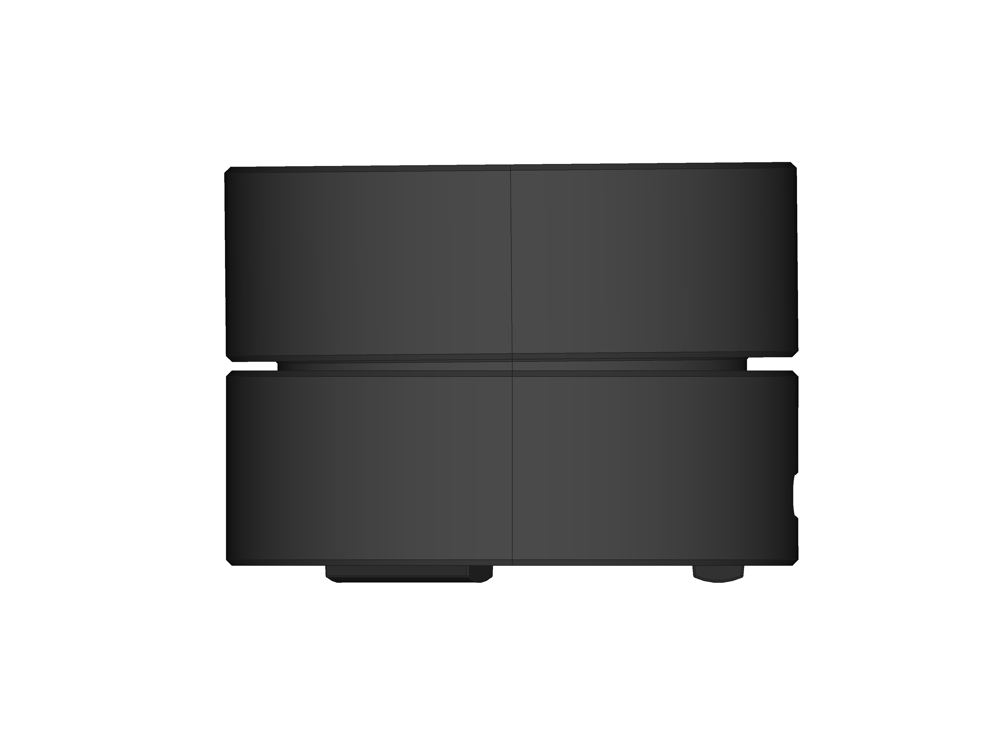

# Cochlea ビルドガイド

## 目次

- [0. 内部構造](#0-内部構造)
- [1. Remapによるキーマップ書き換え](#1-Remapによるキーマップ書き換え)
- [2. ノブの調整](#2-ノブの調整)

---

## 0. 内部構造

|||
|---|---|

---

## 1. Remapによるキーマップ書き換え

　CochleaはRemapに対応しています。
ChromeからRemapにアクセスすることでキーマップをChrome上で書き換えることができます。

- [Remap - https://remap-keys.app/](https://remap-keys.app/)

　標準では以下のようにキーアサインされています。

| 操作 | Remap表記 | QMK Keycode | 説明 |
|---|---|---|---|
|時計回り|Audio Volume +|KC_AUDIO_VOL_UP|音量アップ(Windows)|
|反時計回り|Audio Volume -|KC_AUDIO_VOL_DOWN|音量ダウン(Windows)|
|押し込み|Audio Mute|KC_AUDIO_MUTE|ミュート(Windows)|

なお、macOSをご利用されている場合には、以下のようにキーマップを変更してください。

| 操作 | Remap表記 | QMK Keycode | 説明 |
|---|---|---|---|
|時計回り|Vol +|KC_KB_VOLUME_UP|音量アップ(macOS)|
|反時計回り|Vol -|KC_KB_VOLUME_DOWN|音量ダウン(macOS)|
|押し込み|Mute|KC_KB_MUTE|ミュート(macOS)|

　また、押し込みにレイヤー切り替えを割り当てることもできます。
押し込んでいないときと押し込んでいるときの回転操作にそれぞれ別の操作を割り当てることができます。

---

## 2. ノブの調整

　ノブおよび本体の3Dプリントの出力精度とロータリーエンコーダの軸のあそびにより、ノブがやや傾斜している場合があります。
回転操作を行う際にノブと本体がわずかに干渉する恐れがあるため、ノブの取り付けを調整することで回避できます。
ノブは垂直に引き抜くことで取り外すことができます。

||
|---|

---

本ビルドガイドは[Acperience70 spec_02](http://yynmt.com/kb/a70s2.html)で書かれました。
